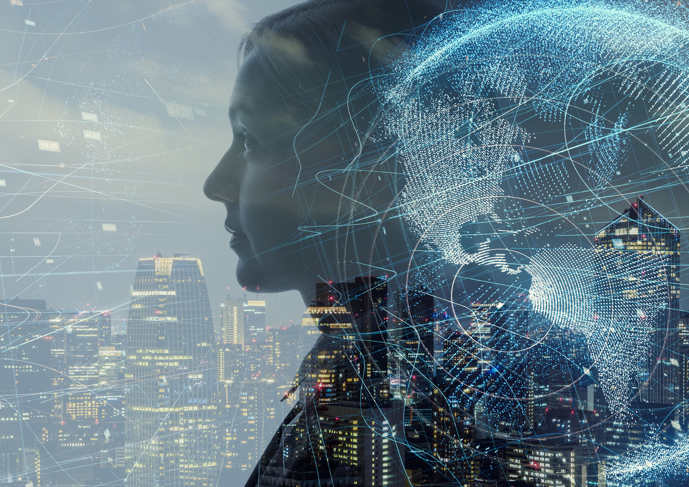

# AIYA - Artificial Youtuber Project

This is a hobby project inspired by @carykh and other youtubers, done in my spare time.

The idea is to create AI youtuber thats fully automated and can create daily videos on given subjects, voted by viewers.

This is an orchestraded attempt to create first artificial personality that is fully autonomous on Youtube. 

My ultimate idea is to use public blockchain voting mechanism as a means of deciding topics of upcomming videos. This would mean AI would be crypto driven by payments accumulated from willingfull participants in form of vote for suggested topic. This is well under **TODO**

This project has wrapped up five different AI's to achieve it's goal (and a lot of ffmpeg!)

## Meet AIYA

## Demo video

---------------------------------------------------------------
### Basic usage (Python 3.6 =>)
1. Download and install Gentle: [https://github.com/lowerquality/gentle](https://github.com/lowerquality/gentle)
2. Install dependencies
> pip3 install -r requirements.txt
3. Spin up Gentle docker image on localhost
> sudo docker run --network host -P lowerquality/gentle
4. In project root folder execute this command, while replacing the value of '-i' (in different terminal)
> python3 aiya.py -i "Love is"
5. Result will be in '/result' folder
6. For uploding to YT, fill the credentials file in 'configuration/ytcreds/' and enter -u parameter as 'True' 
---------------------------------------------------------------
## Features
### Generate video
- Create YT like video from a phrase or a term
- Supports video or image background
- Overlay images over static image background
- Overlay images over video
- Randomization on run (different text everytime you run it)
- Control duration of visibility of memes
- Control density of memes
- Control positioning of memes
- Directly upload to YT
- Create thumbnail
- Support title adding as parametar

### Edit video
- JumpCutter
- SpeedUpper **TODO**
- SlowDowner **TODO**
- BeepCutter
---------------------------------------------------------------
## TODO
- Better error handling
- Add support for image animation (rolling picture, popups, transition style), e.g.,
> ffmpeg -i out.mp4 -i images/bicycle.png -filter_complex "[1] scale=100:100 [tmp]; [0][tmp] overlay=x='if(gte(t,2), t*100, 10)':y=30" outputfile.mp4
- Add support for random zoom in effects
- Exclude repeated words from the bag (mix verbs and phrases)
- Add support for loading marked or unmarked text directly
- Add support for blockchain or twitter voting

Both editing and generation can be used just by itself by executing AiEdit.py and AiGenerate.py. In the comments you can find example commands to run.
---------------------------------------------------------------
## AI stack:
- OpeAI GTP-2 774M model trained in Google collab: [https://github.com/openai/gpt-2](https://github.com/openai/gpt-2) [**for text creation**]
- Google Speech Recognizer: [https://cloud.google.com/speech-to-text/](https://cloud.google.com/speech-to-text/) [**for speech to text**]
- Gentle: [https://github.com/lowerquality/gentle](https://github.com/lowerquality/gentle) [**for timed transcription from audio**]
- SpaCy: [https://github.com/explosion/spaCy](https://github.com/explosion/spaCy) [**for noun/verbs extraction**]
- TTS ParallelWave GAN model:[https://github.com/kan-bayashi/ParallelWaveGAN](https://github.com/kan-bayashi/ParallelWaveGAN) [**for generating voice from text**]
---------------------------------------------------------------
## Contact
branislav.djalic@gmail.com
---------------------------------------------------------------
## Contributions
Feel free to contribute, comment, improve or make your own AI youtuber ;)